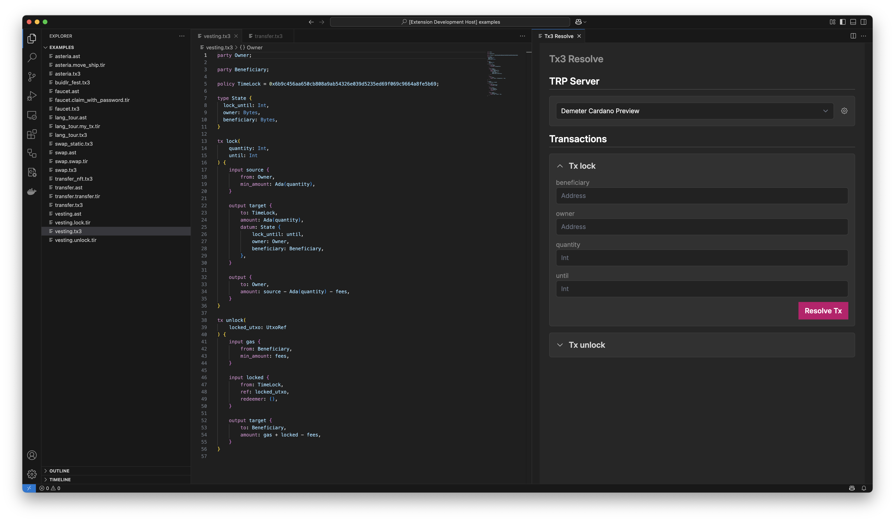
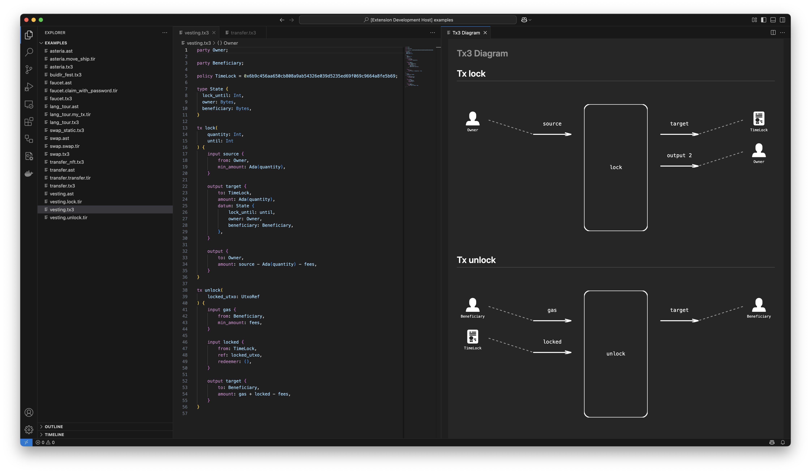

# Tx3 Language Support

Tx3 Language Support is a Visual Studio Code extension designed to enhance your development experience with the Tx3 toolchain. 
It provides robust features such as syntax highlighting, LSP diagnostics, and interactive panels for transaction resolution and visualization.

For more information about Tx3, visit the [official documentation](https://docs.txpipe.io/tx3).

## Requirements

To use this extension, ensure that the Tx3 toolchain is installed on your system. 
You can find installation instructions and a quick start guide in the [Tx3 documentation](https://docs.txpipe.io/tx3/quick-start).

## Features

This extension offers the following features to streamline your workflow:

- **Syntax Highlighting**: Provides clear and intuitive syntax highlighting for Tx3 files, making your code easier to read and understand.
- **LSP Diagnostics**: Language Server Protocol (LSP) to deliver real-time diagnostics, helping you identify and resolve issues as you code.
- **Tx3 Resolve Panel**: An interactive panel for generating the transaction CBOR.
- **Tx3 Diagram Visualization Panel**: A graphical interface for visualizing transaction diagrams.

### Tx3 Resolve Panel

The **Tx3 Resolve Panel** allows you to interactively generate a transaction CBOR using a TRP server. 

To open the panel:
- Use the command palette (`Cmd+Shift+P`) and search for `Open Tx3 Resolve Panel`.
- Alternatively, click the `play` button located in the editor title bar.

### Tx3 Diagram Panel

The **Tx3 Diagram Panel** provides a graphical representation of transactions in your Tx3 files.
This feature is particularly useful for understanding complex transaction structures at a glance.

To open the panel:
- Use the command palette (`Cmd+Shift+P`) and search for `Open Tx3 Diagram Panel`.
- Alternatively, click the `diagram` button located in the editor title bar.

Each transaction in your Tx3 file will be visualized as a diagram, offering a clear and concise overview.

